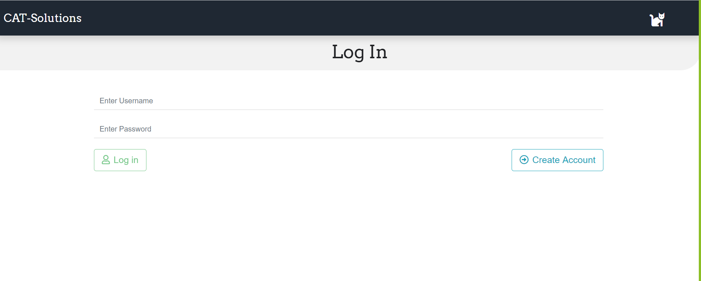
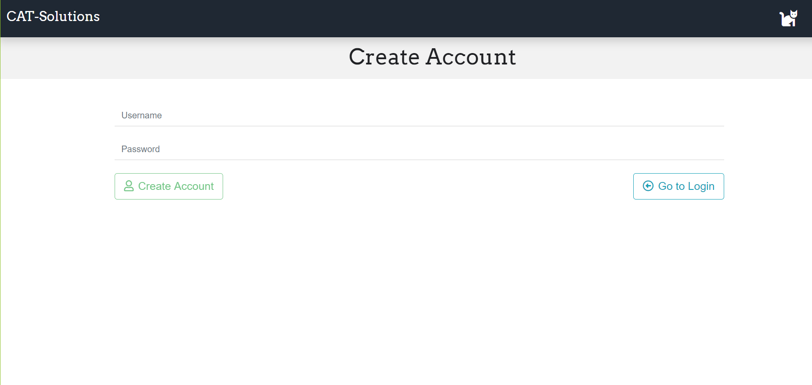
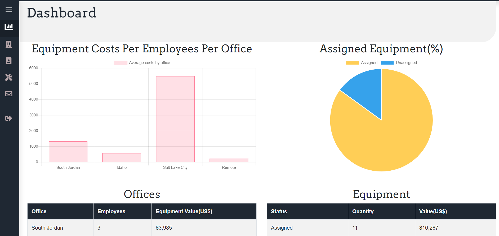
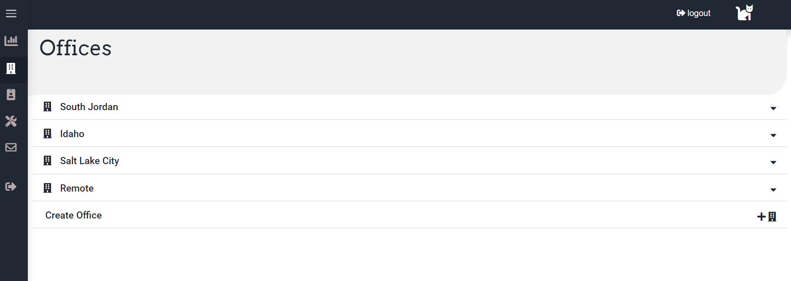
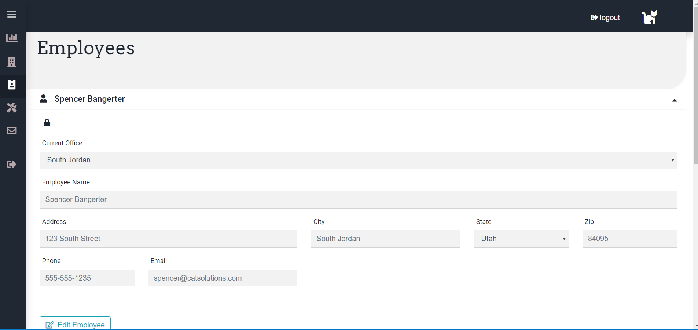
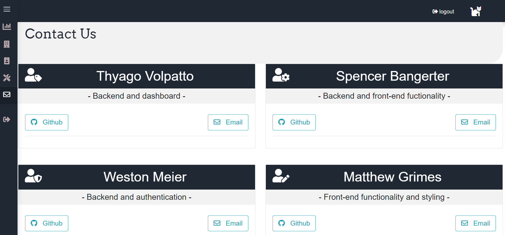

# CAT-Solutions.

## A central system to track physical business assets

CAT Solutions is a MERN stack application built to solve any businesses needs to track their physical assets for each office location and each piece of equipment assigned to each employee of the company. With the ability to add custom reporting for accounting, administrative, and general purposes our system is guaranteed to ease your burden of tracking spreadsheets manually. 

 

 

 

 

 

 

 ## Running 

 The application is deployed on [Heroku](https://www.heroku.com/home).

 [Click here(https://cat-solutions.herokuapp.com/) to access it.

 ## Running locally

 1. Install the dependencies: ```npm install```;
 2. Run: ```npm start```;
 3. The default  port is *3000*, so to access you must go to **http://localhost:3000**


## Technology Used

* Front End: react, react-bootstrap, chart.js, CSS, axios, react-date-picker, react-router
* Database: MongoDB, Mongoose
* Back End: Express, passport.js, bcrypt.js, browser-router, cookie-parser, JWT
* DevOps: GitHub, Heroku

## Developers 

   * [Matthew Grimes](https://github.com/Matthewlgrimes94)
   * [Spencer Bangerter](https://github.com/SpencerBangerter)
   * [Thyago Volpatto](https://github.com/tvolpatto)
   * [Weston Meier](https://github.com/westonbmeier)


